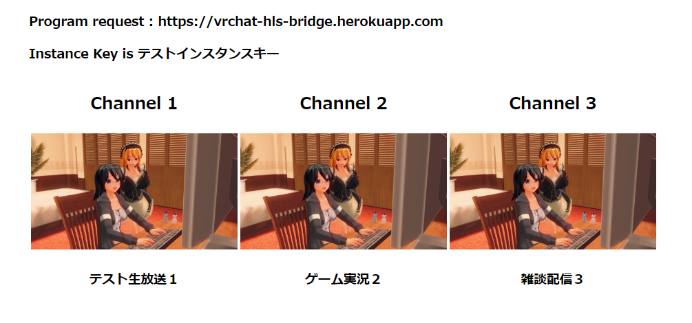

# YUKIMOCHI VRChat HLS Bridge

## これはなに？
VRChat で各種ライブストリーミングを視聴するためのナビゲーションを提供する Web サービスです。

（ナビゲーション：番組管理機能・アドレス解析機能・リダイレクト機能）

### 対応ライブストリーミングサービス
 - [YouTube Live]()
 - [SHOWROOM]()
 - [Mirrativ]()
 - [OPENREC.tv]()

### 概要
ライブストリーミングをワールド全員で WebPanel から見ることのできるサービスです。

また、3つまで番組をブラウザから登録でき、それをワールドからリアルタイムで確認・番組変更できる番組カタログ機能が搭載されています。



### 提供方法
この Web サービスは、3種類の方法で提供されます。
 - YUKIMOCHI の SaaS として提供されているサーバを利用する。（無償公開）

[https://vrchat-hls-bridge.herokuapp.com](https://vrchat-hls-bridge.herokuapp.com)

 - Heroku ボタンで自分専用のサーバを Heroku に作成する。（月1000時間まで無料）

[](https://heroku.com/deploy?template=https://github.com/yukimochi/VRC_HLS)

 - お手持ちのサーバに Docker コンテナで展開する。（`Dockerfile`, `docker-compose.yml` を提供しています。）

## 使い方
### はじめに
このサービスでは `インスタンスキー` と呼ばれる、ワールドと当サービスの間で共有するキーワードによって、番組管理をはじめとする各種サービスを提供します。これは、ワールド設置者が設定してワールドに埋め込むものです。

したがって、 `インスタンスキー` が知れ渡ると、見ず知らずのユーザーにより番組管理を勝手に行われる可能性があります。当サービスを利用される場合、ワールドの更新が容易な `Unlisted` ワールドでご利用ください。このサービスにより発生した全ての障害・事故について一切の責任を負いかねます。

### 1. インスタンスキー を決定する
VRChat HLS Bridge とワールドを接続する `インスタンスキー` を決定します。 （英数記号漢字を使うことができます）

以下の利用状況の確認方法でインスタンスキーに登録されている番組を確認できるので、利用されていないことを確認します。（重複した場合の折衝機能はありません。）

利用状況の確認方法： [https://vrchat-hls-bridge.herokuapp.com/static/dashboard.html?sid=<利用したいインスタンスキー>](https://vrchat-hls-bridge.herokuapp.com/static/dashboard.html?sid=<利用したいインスタンスキー>)

※ `<利用したいインスタンスキー>` を希望のインスタンスキーに置き換えてアクセスしてください。

### 2. ワールドに2つの WebPanel と 3つの VRC_Trigger を配置します。

#### WebPanel
 1. `Resolution Width` : `1940` (必須), `Resolution Height` : `1100` である `WebPanel_A`
 1. `Resolution Width` : `1080`, `Resolution Height` : `600` 程度の `WebPanel_B`

`WebPanel_A` は、動画の上映を行う WebPanel です。 `Start URI` は、 `about:blank` を指定します。

`WebPanel_B` は、番組カタログ（確認方法で表示される画面）を表示する WebPanel です。
 - 番組カタログに `インスタンスキー` を表示する場合は、`Start URI` に以下のように設定します。（不特定多数から生放送の登録を希望する場合）

`https://vrchat-hls-bridge.herokuapp.com/static/dashboard.html?sid=<利用したいインスタンスキー>`

 - 番組カタログに `インスタンスキー` を表示しない場合は、`Start URI` に以下のように設定します。

`https://vrchat-hls-bridge.herokuapp.com/static/dashboard.html?key=hidden&sid=<利用したいインスタンスキー>`

#### VRC_Trigger
`OnInteract` で始動する `AlwaysBufferOne` の `VRC_Trigger` を3つ用意し、それぞれに以下の通りの Actions を登録します。

 - チャンネル１ `Set-WebPanelURI` : `https://vrchat-hls-bridge.herokuapp.com/api/live?id=0&instance=<利用したいインスタンスキー>`
 - チャンネル２ `Set-WebPanelURI` : `https://vrchat-hls-bridge.herokuapp.com/api/live?id=1&instance=<利用したいインスタンスキー>`
 - チャンネル３ `Set-WebPanelURI` : `https://vrchat-hls-bridge.herokuapp.com/api/live?id=2&instance=<利用したいインスタンスキー>`

※ いずれも `Receiver` に `WebPanel_A` を指定します。

これらの `VRC_Trigger` を `Interact` した際に、 `WebPanel_A` にカタログに登録されているライブストリーミングが再生されます。

### 3. ブラウザからライブストリーミングを登録します。
[https://vrchat-hls-bridge.herokuapp.com](https://vrchat-hls-bridge.herokuapp.com)

こちらから、 `<利用したいインスタンスキー>` を `Instance Key` に入力し、 `LiveStream URL` に生放送のURLを入力し `Add Playlist` を確定します。

確認画面で生放送を確認して、再度 `Add Playlist` を確定すると、 `<利用したいインスタンスキー>` のチャンネルにライブストリーミングが登録されます。（3件登録済みの場合、登録が最も古いものから上書きされます。）

※ `インスタンスキー` ごとに最終登録から 8時間が経過すると登録内容は抹消されます。

### 4. ライブストリーミングの登録は、ワールドの `WebPanel_B` に30秒以内に反映されます。
視聴したいチャンネルの `VRC_Trigger` を `Interact` して、ワールドの `WebPanel_A` で生放送を見ることができます。

### 5. 色合いがおかしい件の修正。
WebPanel では、色の発色がおかしいという現象が[見つかっています](http://uuupa.hatenablog.com/entry/2018/04/05/003936)。

Duplicate Screen で、 [UUUPA/Degamma (MIT Licence)](https://github.com/UUUPA/Degamma) などのシェーダを適用するとよい。

## 使い方（応用）
### 音量変更を行う javascript 関数について
javascript の `audio_control` 関数を実行することで、オーディオの音量を変更できます。

#### audio_control (volume:Number)
  - volume (Number) : 音量を設定する。 `0 ~ 100` までの整数値。初期設定では `100` 。 `100` を超えてもそれ以上大きくなることはない。

  例：( `Set-WebPanelURI` や ブックマークレット)
  ````
  javascript:setTimeout(audio_control(50),0);
  ````

### Heroku や 独自のサーバを構築された場合
上記の使い方に表示されているドメイン(`https://vrchat-hls-bridge.herokuapp.com`)をご自身のドメインに置き換えます。

### m3u8 ファイルに直接リダイレクトしたい場合
手順2で設定した URL は、動画プレイヤーへのリダイレクトを行いますが、直接 m3u8 にリダイレクトさせたい場合があるかもしれません。

以下の URL を利用して直接 m3u8 のアドレスへのリダイレクトを提供します。
 - チャンネル１ `https://vrchat-hls-bridge.herokuapp.com/api/direct?id=0&instance=<利用したいインスタンスキー>`
 - チャンネル２ `https://vrchat-hls-bridge.herokuapp.com/api/direct?id=1&instance=<利用したいインスタンスキー>`
 - チャンネル３ `https://vrchat-hls-bridge.herokuapp.com/api/direct?id=2&instance=<利用したいインスタンスキー>`
